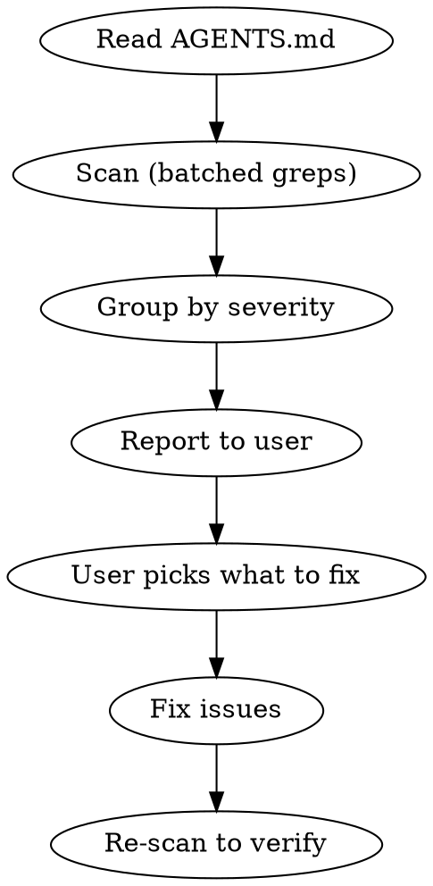

# Roadie audit

Scan a codebase for violations of Roadie design system conventions, report findings grouped by severity, and fix them.

## Prerequisites

1. **Read** the `AGENTS.md` file in this Roadie repository at the start of every audit — it's the source of truth and may have changed since this skill was written.
2. **Identify the target directory** — ask the user if not obvious from context.

## Exclude paths

All scans must skip generated/vendored files. When using the Grep tool, set `path` to the target source directory (e.g., `src/`) and use `glob: "*.{tsx,ts,jsx,js,css}"` to scan only source files. Verify early results don't include:

- `node_modules/`, `dist/`, `build/`, `.next/`, `.turbo/`
- `.archive/`, `coverage/`, `__generated__/`
- `*.min.js`, `*.bundle.js`

## Audit process



1. **Read** the Roadie repo's `AGENTS.md` for current guidelines
2. **Scan** the target directory using the checks below — run independent checks in parallel by issuing multiple Grep tool calls in a single message (see Parallelization guide)
3. **Report** findings grouped by severity with file paths and line numbers
4. **Ask** the user which categories to fix (or fix all if instructed)
5. **Fix** issues, then re-scan to confirm no regressions

## Severity levels

| Level | Meaning | Action |
|-------|---------|--------|
| Critical | Breaks styling or Roadie's color system | Must fix |
| Warning | Deviation from conventions, works but inconsistent | Should fix |
| Info | Opportunity for improvement, review manually | May fix |

**Exception:** Setting theme/accent color via CSS custom properties or ThemeProvider config is intentional — not a violation.

---

## What to check

### Group A: Colors

#### A1. Hardcoded Tailwind default colors [Critical]

Roadie disables default Tailwind color utilities. All colors must be semantic.

```
(bg|text|border|ring|outline|shadow|from|to|via)-(red|blue|green|gray|slate|zinc|stone|orange|amber|yellow|lime|emerald|teal|cyan|sky|indigo|violet|purple|fuchsia|pink|rose|white|black)-\d
```

**Note:** This pattern excludes `neutral` — Roadie has its own `neutral-0` through `neutral-13` scale. Raw Roadie scale references like `border-neutral-0` are covered by check A2 (Info level) instead.

**Fix:** Replace with semantic equivalents:
- `bg-gray-100` → `bg-subtle` or `bg-normal`
- `bg-gray-900` → `bg-strong` or `emphasis-strong`
- `text-gray-500` → `text-subtle`
- `text-gray-900` → `text-strong`
- `border-gray-200` → `border-subtle`
- Colored backgrounds → `intent-{name} emphasis-{level}`

#### A2. Raw intent scale references [Info]

These use Roadie's own scale names (`brand-4`, `accent-11`) so they ARE semantic — but when an emphasis shortcut would be cleaner, flag them. Not always wrong.

```
(bg|text|border|ring|outline|from|to|via)-(brand|info|accent|danger|success|warning|neutral)-\d+
```

For each match, check whether an emphasis shortcut exists:

| Raw reference | Possible emphasis replacement |
|---------------|-------------------------------|
| `bg-brand-2`, `bg-info-3` | `intent-brand bg-subtle` or `intent-info emphasis-subtle` |
| `bg-brand-9`, `bg-accent-9` | `intent-brand emphasis-strong` |
| `text-brand-11`, `text-accent-11` | `intent-brand text-normal` or `intent-accent text-normal` |
| `border-brand-7` | `intent-brand border-normal` |

**Only flag if** the emphasis equivalent is a clear improvement. If the specific scale step is needed for visual precision (e.g., an overlay at a specific opacity), it's fine to keep.

#### A3. Hardcoded hex/rgb/oklch colors [Critical]

```
# Arbitrary value brackets with color values
\[#[0-9a-fA-F]{3,8}\]
# Inline styles with color properties
style=.*(?:background|color|border).*#[0-9a-fA-F]
# CSS color functions
rgb\(|rgba\(|hsl\(|hsla\(
```

**Fix:** Replace with Roadie tokens (`var(--intent-*)`) or semantic utilities.

#### A4. Dark mode via Tailwind variants [Critical]

```
dark:
```

Roadie handles dark mode via CSS custom properties — `dark:` variants are unnecessary and will conflict.

**Fix:** Remove `dark:` variants and use semantic color utilities instead.

---

### Group B: Layout

#### B1. flex-col stacks instead of grid [Warning]

```
flex flex-col
```

**Fix:** Replace `flex flex-col gap-*` with `grid gap-*`. Keep `flex` only for content-driven rows (tags, nav items, wrapping) or when children need to control their own sizing.

#### B2. Margin instead of gap [Warning]

```
\b(mt|mb|ml|mr|mx|my)-\d
space-(x|y)-
```

**Note:** Not all margin is wrong — margin on a page wrapper or for specific offsets is fine. Flag only margin used to space siblings that should use parent `gap` instead.

---

### Group C: Icons

#### C1. Wrong import path [Warning]

```
from ['"]@phosphor-icons/react['"]
```

Should use `@phosphor-icons/react/ssr` in server components. If the project uses a centralized icons file that re-exports with `/ssr`, check that file rather than flagging every consumer import.

#### C2. Deprecated bare name imports [Warning]

```
import \{[^}]*\} from ['"]@phosphor-icons/react
```

Imported names should use the `Icon` suffix: `HeartIcon` not `Heart`.

#### C3. Numeric size prop on icons [Warning]

```
size=\{?\d
```

Icons should use Tailwind `className` for sizing, not the Phosphor `size` prop.

| Numeric size prop | Tailwind className | Semantic use |
|-------------------|--------------------|--------------|
| `size={12}` | `className='size-3'` | XS (badges, tags) |
| `size={14}` | `className='size-3.5'` | — |
| `size={16}` | `className='size-4'` | SM (buttons, inline — default) |
| `size={20}` | `className='size-5'` | MD (nav, standalone) |
| `size={24}` | `className='size-6'` | LG (headers, cards) |
| `size={32}` | `className='size-8'` | — |

#### C4. Wrong icon weight [Info]

```
weight=['"](?!bold|fill)
```

Should be `weight='bold'` by default. `fill` only for active/selected states.

---

### Group D: Typography

#### D1. Headings without display classes [Warning]

```
<h[1-6](?![^>]*text-display-)
```

All `<h1>`–`<h6>` elements should have `text-display-ui-*` or `text-display-prose-*` classes. Headings inside `<Prose>` are exempt (Prose applies typography automatically).

**Fix:** Add `text-display-ui-N` (for UI headings) or `text-display-prose-N` (for content headings) plus `text-strong`. Match N to heading level as a starting point.

#### D2. Custom heading/text wrapper components [Warning]

```
<Heading[\s/>]|<Text[\s/>]|<Typography[\s/>]
```

Roadie uses raw HTML elements with utility classes — no wrapper components.

**Fix:** Replace with raw `<h1>`–`<h6>`, `<p>`, `<span>` with utility classes like `text-display-ui-3 text-strong`, `text-subtle text-sm`, etc.

---

### Group E: Components

#### E1. Missing intent/emphasis on interactive elements [Warning]

```
<Button(?![^>]*(intent|emphasis))
<button(?![^>]*(intent-|emphasis-))
```

**Note:** Components inherit intent from parent context — only flag if there's no ancestor with `intent-*` either.

#### E2. Deprecated colorPalette prop [Warning]

```
colorPalette=
```

**Fix:** Replace with `intent=` using this mapping:
- `colorPalette='primary'` → `intent='brand'`
- `colorPalette='accent'` → `intent='accent'`
- `colorPalette='information'` → `intent='info'`
- `colorPalette='danger'` → `intent='danger'`
- `colorPalette='success'` → `intent='success'`
- `colorPalette='warning'` → `intent='warning'`
- `colorPalette='neutral'` → `intent='neutral'`

#### E3. Form controls outside Field wrapper [Warning]

Grep for standalone form controls, then read surrounding context (~20 lines above) to check for a `<Field` wrapper:

```
<Input[\s/>]|<Textarea[\s/>]|<Select[\s>]|<RadioGroup[\s>]|<Combobox[\s>]|<Autocomplete[\s>]
```

**Fix:** Wrap in `<Field>` with `<Field.Label>`, `<Field.ErrorText>`, and pass `invalid`/`required`/`disabled` to Field.

#### E4. Select.Portal/Positioner/Popup instead of Select.Content [Warning]

```
Select\.Portal|Select\.Positioner|Select\.Popup
```

**Fix:** Replace the Portal + Positioner + Popup nesting with `<Select.Content>`.

#### E5. Non-semantic HTML (div/span with onClick) [Warning]

```
<div[^>]*onClick
<span[^>]*onClick
```

**Fix:** Use `<button>` or Base UI `<Button>`.

---

### Group F: Interactions

#### F1. Manual hover/focus/active variants instead of is-interactive [Info]

```
hover:bg-|hover:text-|hover:border-|hover:shadow-|focus:bg-|focus:border-|active:scale-|active:bg-
```

**Note:** Not all `hover:` usage is wrong — decorative hover effects or micro-interactions may be intentional. Flag on elements that are buttons, links, or have `onClick`.

**Fix:** Use `is-interactive` (buttons, cards, clickable elements) or `is-interactive-field` (form inputs) which provide consistent hover/focus/active/disabled states.

#### F2. Inline styles with Tailwind equivalents [Warning]

```
style=\{\{
```

For each match, check whether a Tailwind utility exists:

| Inline style | Tailwind equivalent |
|--------------|---------------------|
| `style={{ flexShrink: 0 }}` | `shrink-0` |
| `style={{ flexGrow: 1 }}` | `grow` |
| `style={{ flex: '1 1 0' }}` | `flex-1` |
| `style={{ overflow: 'hidden' }}` | `overflow-hidden` |
| `style={{ minWidth: 0 }}` | `min-w-0` |
| `style={{ whiteSpace: 'nowrap' }}` | `whitespace-nowrap` |
| `style={{ textOverflow: 'ellipsis' }}` | `truncate` |

**Note:** Dynamic values from JS (e.g., `style={{ width: calculatedWidth }}`) are legitimate. Only flag styles that have static Tailwind equivalents.

---

### Group G: Setup

#### G1. Missing Roadie CSS import [Critical]

Check the main CSS entry point (usually `globals.css`, `app.css`, or `index.css`) for:

```
@import ['"]@oztix/roadie-core/css
```

#### G2. Missing @source directive [Critical]

Same CSS file should contain a `@source` directive pointing to the Roadie components dist:

```
@source.*roadie-components
```

The exact path depends on project structure, typically: `@source "../../node_modules/@oztix/roadie-components/dist";`

**Fix:** Add after the Roadie CSS import. Adjust the relative path to point to `node_modules/@oztix/roadie-components/dist`.

---

## Reporting format

```
## Roadie audit results

### Critical (must fix)
- **[A1] Hardcoded Tailwind colors** — N instances across M files
  - `src/components/Header.tsx:14` — `bg-gray-900` → `bg-strong`
  - ...
- **[A3] Hardcoded hex/rgb colors** — N instances
  - ...

### Warning (should fix)
- **[B1] flex-col stacks** — N instances
  - `src/components/Card.tsx:8` — `flex flex-col gap-4` → `grid gap-4`
- **[F2] Inline styles** — N instances
  - `src/components/Icon.tsx:12` — `style={{ flexShrink: 0 }}` → `shrink-0`

### Info (review manually)
- **[A2] Raw scale references** — N uses (check if emphasis shortcuts apply)
- **[F1] Manual hover variants** — N uses
```

## Quick fix reference

| Pattern | Replacement | Check |
|---------|-------------|-------|
| `bg-gray-100` | `bg-subtle` | A1 |
| `bg-gray-900` | `emphasis-strong` or `bg-strong` | A1 |
| `text-gray-500` | `text-subtle` | A1 |
| `border-gray-200` | `border-subtle` | A1 |
| `dark:bg-*` | remove, use semantic utility | A4 |
| `flex flex-col gap-4` | `grid gap-4` | B1 |
| `mt-4` between siblings | parent `gap-4` | B2 |
| `size={16}` on icon | `className='size-4'` | C3 |
| `size={20}` on icon | `className='size-5'` | C3 |
| `size={24}` on icon | `className='size-6'` | C3 |
| `colorPalette='primary'` | `intent='brand'` | E2 |
| `colorPalette='information'` | `intent='info'` | E2 |
| `colorPalette='accent'` | `intent='accent'` | E2 |
| `Select.Portal + Positioner + Popup` | `Select.Content` | E4 |
| `style={{ flexShrink: 0 }}` | `shrink-0` | F2 |
| `style={{ flexGrow: 1 }}` | `grow` | F2 |
| `<div onClick={...}>` | `<button onClick={...}>` | E5 |
| `hover:bg-* + focus:ring-*` on button | `is-interactive` | F1 |

## Parallelization guide

Run independent checks in parallel by issuing multiple Grep calls in a single message:

**Batch 1** (colors):
- A1: `(bg|text|border|ring|outline|shadow|from|to|via)-(red|blue|green|gray|slate|zinc|stone|orange|amber|yellow|lime|emerald|teal|cyan|sky|indigo|violet|purple|fuchsia|pink|rose|white|black)-\d`
- A2: `(bg|text|border|ring|outline|from|to|via)-(brand|info|accent|danger|success|warning|neutral)-\d+`
- A3: `\[#[0-9a-fA-F]{3,8}\]`
- A4: `dark:`

**Batch 2** (layout + icons):
- B1: `flex flex-col`
- B2: `space-(x|y)-`
- C3: `size=\{?\d`
- C4: `weight=['"](?!bold|fill)`

**Batch 3** (typography + components + interactions):
- D1: `<h[1-6]` (then check for `text-display-` in results)
- E2: `colorPalette=`
- E4: `Select\.Portal|Select\.Positioner|Select\.Popup`
- F2: `style=\{\{`

**Batch 4** (setup — check CSS files only):
- G1: `@import.*roadie-core`
- G2: `@source.*roadie-components`

## Fixing strategy

- Fix one category at a time, starting with critical
- After each category, re-scan to verify no regressions
- For large codebases, offer to fix file-by-file or all at once
- Always preserve existing behaviour — semantic replacements should render identically
- When fixing raw scale references (A2), identify the intent context first. If inside an `intent-*` ancestor, only the emphasis/bg/text class is needed
- When removing `colorPalette` (E2), also check if the component still uses other v1 patterns — flag for broader migration if so
- For headings (D1), choose `text-display-ui-*` for UI headings and `text-display-prose-*` for content headings
