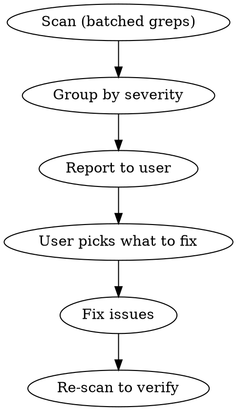

# Roadie audit

Scan a codebase for violations of Roadie design system conventions, report findings grouped by severity, and fix them.

This skill is self-contained — it ships all the rules it needs to run in any consumer repo that uses `@oztix/roadie-core` and `@oztix/roadie-components`. You do not need the Roadie source repo checked out locally.

## Prerequisites

1. **Identify the target directory** — ask the user if not obvious from context (usually `src/` or `app/`).
2. **Optional freshness check** — fetch the latest `AGENTS.md` from the Roadie repo if you suspect the rules below may be stale:
   ```
   WebFetch https://raw.githubusercontent.com/TicketSolutionsPtyLtd/roadie/main/AGENTS.md
   ```
   Only do this if the user explicitly asks for the latest rules or if a check below produces confusing results. The rules in this skill are authoritative for normal audits.

## Exclude paths

All scans must skip generated/vendored files. When using the Grep tool, set `path` to the target source directory (e.g., `src/`) and use `glob: "*.{tsx,ts,jsx,js,css}"` to scan only source files. Verify early results don't include:

- `node_modules/`, `dist/`, `build/`, `.next/`, `.turbo/`
- `.archive/`, `coverage/`, `__generated__/`
- `*.min.js`, `*.bundle.js`

## Audit process



1. **Scan** the target directory using the checks below — run independent checks in parallel by issuing multiple Grep tool calls in a single message (see Parallelization guide)
2. **Report** findings grouped by severity with file paths and line numbers
3. **Ask** the user which categories to fix (or fix all if instructed)
4. **Fix** issues, then re-scan to confirm no regressions

## Severity levels

| Level | Meaning | Action |
|-------|---------|--------|
| Critical | Breaks styling or Roadie's color system | Must fix |
| Warning | Deviation from conventions, works but inconsistent | Should fix |
| Info | Opportunity for improvement, review manually | May fix |

**Exception:** Setting theme/accent color via CSS custom properties or ThemeProvider config is intentional — not a violation.

---

## What to check

### Group A: Colors

#### A1. Hardcoded Tailwind default colors [Critical]

Roadie disables default Tailwind color utilities. All colors must be semantic.

```
(bg|text|border|ring|outline|shadow|from|to|via)-(red|blue|green|gray|slate|zinc|stone|orange|amber|yellow|lime|emerald|teal|cyan|sky|indigo|violet|purple|fuchsia|pink|rose|white|black)-\d
```

**Note:** This pattern excludes `neutral` — Roadie has its own `neutral-0` through `neutral-13` scale. Raw Roadie scale references like `border-neutral-0` are covered by check A2 (Info level) instead.

**Fix:** Replace with semantic equivalents:
- `bg-gray-100` → `bg-subtle` or `bg-normal`
- `bg-gray-900` → `bg-strong` or `emphasis-strong`
- `text-gray-500` → `text-subtle`
- `text-gray-900` → `text-strong`
- `border-gray-200` → `border-subtle`
- Colored backgrounds → `intent-{name} emphasis-{level}`

#### A2. Raw intent scale references [Info]

These use Roadie's own scale names (`brand-4`, `accent-11`) so they ARE semantic — but when an emphasis shortcut would be cleaner, flag them. Not always wrong.

```
(bg|text|border|ring|outline|from|to|via)-(brand|info|accent|danger|success|warning|neutral)-\d+
```

For each match, check whether an emphasis shortcut exists:

| Raw reference | Possible emphasis replacement |
|---------------|-------------------------------|
| `bg-brand-2`, `bg-info-3` | `intent-brand bg-subtler` or `intent-info emphasis-subtle` |
| `bg-brand-9`, `bg-accent-9` | `intent-brand emphasis-strong` |
| `bg-brand-12` | `intent-brand emphasis-inverted` |
| `border-brand-7` | `intent-brand border-normal` |

The text scale maps one step to one utility, so match the number rather than the
adjective. `text-strong` is the darkest, not the most saturated.

| Step | Utility |
|------|---------|
| 0 | `text-inverted` |
| 10 | `text-subtler` |
| 11 | `text-subtle` |
| 12 | `text-normal` |
| 13 | `text-strong` |

**Only flag if** the emphasis equivalent is a clear improvement. If the specific scale step is needed for visual precision (e.g., an overlay at a specific opacity), it's fine to keep.

#### A3. Hardcoded hex/rgb/oklch colors [Critical]

```
# Arbitrary value brackets with color values
\[#[0-9a-fA-F]{3,8}\]
# Inline styles with color properties
style=.*(?:background|color|border).*#[0-9a-fA-F]
# CSS color functions
rgb\(|rgba\(|hsl\(|hsla\(
```

**Fix:** Replace with Roadie tokens (`var(--intent-*)`) or semantic utilities.

#### A4. Dark mode via Tailwind variants [Critical]

```
dark:
```

Roadie handles dark mode via CSS custom properties — `dark:` variants are unnecessary and will conflict.

**Fix:** Remove `dark:` variants and use semantic color utilities instead.

#### A5. Chart colours not from chart tokens [Critical]

Charts take every colour from `--chart-*` tokens (`--chart-1` to `--chart-8`,
`--chart-heat-*`, `--chart-diverge-*`, `--chart-status-*`,
`--chart-highlight`, data greys and chart ink). Look in files that import a
chart library or render `<svg>` marks:

```
(fill|stroke|color|backgroundColor)[=:]\s*['"{]?\s*#[0-9a-fA-F]{3,8}
(fill|stroke|bg|text)-(brand|accent|info|success|warning|danger|neutral)-\d+
```

**Fix:** use `fill-chart-N` / `stroke-chart-N` classes. When the slot is
dynamic, use `style={{ fill: chartColorVar(i) }}` from
`@oztix/roadie-core/dataviz`, because Tailwind purges `fill-chart-${i}`.
Canvas and PDF renderers read hex values from `chartHex(mode)`.

#### A6. Status or intent colours used as series [Warning]

A series coloured with `--chart-status-*` or an intent scale reads as good or
bad. Series use categorical slots. Status colours only mark meaning, with an
icon or label.

---

### Dashboards

- Dashboards use `Dashboard` and `Dashboard.Section` with card `size`
  (`stat`, `sm`, `md`, `lg`, `full`), not hand-written grid spans.
- Headline numbers use `StatTile` or `DataCard`, not a hand-rolled card.
- A card shows a value with a delta, or a takeaway, never both.
- Deltas use `Delta` (arrow plus words), never colour alone.
- Tables with sparklines or meters use `DataTable`, with at most two visual
  columns and a `priority` on low-value columns.
- Dashboards described as JSON pass `validateDashboard` from
  `@oztix/roadie-core/dashboard` with no errors.
- UI code that only needs sizes, kinds or copy limits imports from the
  zod-free `@oztix/roadie-core/dashboard-layout` subpath instead, so it
  doesn't pull in zod.
- Labels stay within about 22 characters on `stat` cards so they don't truncate; `md` cards are narrowest on tablet (about 35/38 label/context), `sm`/`lg`/`full` per `COPY_LIMITS`.

---

### Group B: Layout

#### B1. flex-col stacks instead of grid [Warning]

```
flex flex-col
```

**Fix:** Replace `flex flex-col gap-*` with `grid gap-*`. Keep `flex` only for content-driven rows (tags, nav items, wrapping) or when children need to control their own sizing.

#### B2. Margin instead of gap [Warning]

```
\b(mt|mb|ml|mr|mx|my)-\d
space-(x|y)-
```

**Note:** Not all margin is wrong — margin on a page wrapper or for specific offsets is fine. Flag only margin used to space siblings that should use parent `gap` instead.

---

### Group C: Icons

#### C1. Wrong import path [Warning]

```
from ['"]@phosphor-icons/react['"]
```

Should use `@phosphor-icons/react/ssr` in server components. If the project uses a centralized icons file that re-exports with `/ssr`, check that file rather than flagging every consumer import.

#### C2. Deprecated bare name imports [Warning]

```
import \{[^}]*\} from ['"]@phosphor-icons/react
```

Imported names should use the `Icon` suffix: `HeartIcon` not `Heart`.

#### C3. Numeric size prop on icons [Warning]

```
size=\{?\d
```

Icons should use Tailwind `className` for sizing, not the Phosphor `size` prop.

| Numeric size prop | Tailwind className | Semantic use |
|-------------------|--------------------|--------------|
| `size={12}` | `className='size-3'` | XS (badges, tags) |
| `size={14}` | `className='size-3.5'` | — |
| `size={16}` | `className='size-4'` | SM (buttons, inline — default) |
| `size={20}` | `className='size-5'` | MD (nav, standalone) |
| `size={24}` | `className='size-6'` | LG (headers, cards) |
| `size={32}` | `className='size-8'` | — |

#### C4. Wrong icon weight [Info]

```
weight=['"]
```

Ripgrep has no lookaround, so this matches every explicit weight. Keep the ones
that read `bold`, `fill` or `duotone`; flag the rest.

`bold` is the default. `fill` is for an active or selected state. `duotone` is
for large decorative icons above 48px, wherever they appear: a big `IconTile`,
an `EmptyState` graphic. Below that threshold it reads as under-inked, so a
small inline `duotone` is still a finding.

---

### Group D: Typography

#### D1. Headings without display classes [Warning]

```
<h[1-6][ >]
```

Ripgrep has no lookaround, so this matches every heading. Check each hit for a
`text-display-` class and flag the ones without one.

All `<h1>`–`<h6>` elements should have `text-display-ui-*` or `text-display-prose-*` classes. Headings inside `<Prose>` are exempt (Prose applies typography automatically).

**Fix:** Add `text-display-ui-N` (for UI headings) or `text-display-prose-N` (for content headings) plus `text-strong`. Match N to heading level as a starting point.

#### D2. Custom heading/text wrapper components [Warning]

```
<Heading[\s/>]|<Text[\s/>]|<Typography[\s/>]
```

Roadie uses raw HTML elements with utility classes — no wrapper components.

**Fix:** Replace with raw `<h1>`–`<h6>`, `<p>`, `<span>` with utility classes like `text-display-ui-3 text-strong`, `text-subtle text-sm`, etc.

---

### Group E: Components

#### E1. Missing intent/emphasis on interactive elements [Warning]

```
<Button[ >]
<button[ >]
```

Ripgrep has no lookaround, so these match every button. Check each hit for an
`intent` or `emphasis` and flag the ones without either.

**Note:** Components inherit intent from parent context — only flag if there's no ancestor with `intent-*` either.

#### E2. Deprecated colorPalette prop [Warning]

```
colorPalette=
```

**Fix:** Replace with `intent=` using this mapping:
- `colorPalette='primary'` → `intent='brand'`
- `colorPalette='accent'` → `intent='accent'`
- `colorPalette='information'` → `intent='info'`
- `colorPalette='danger'` → `intent='danger'`
- `colorPalette='success'` → `intent='success'`
- `colorPalette='warning'` → `intent='warning'`
- `colorPalette='neutral'` → `intent='neutral'`

#### E3. Form controls outside Field wrapper [Warning]

Grep for standalone form controls, then read surrounding context (~20 lines above) to check for a `<Field` wrapper:

```
<Input[\s/>]|<Textarea[\s/>]|<Select[\s>]|<RadioGroup[\s>]|<Combobox[\s>]|<Autocomplete[\s>]
```

**Fix:** Wrap in `<Field>` with `<Field.Label>`, `<Field.ErrorText>`, and pass `invalid`/`required`/`disabled` to Field.

#### E4. Select.Portal/Positioner/Popup instead of Select.Content [Warning]

```
Select\.Portal|Select\.Positioner|Select\.Popup
```

**Fix:** Replace the Portal + Positioner + Popup nesting with `<Select.Content>`.

#### E5. Non-semantic HTML (div/span with onClick) [Warning]

```
<div[^>]*onClick
<span[^>]*onClick
```

**Fix:** Use `<button>` or Base UI `<Button>`.

---

### Group F: Interactions

#### F1. Manual hover/focus/active variants instead of is-interactive [Info]

```
hover:bg-|hover:text-|hover:border-|hover:shadow-|focus:bg-|focus:border-|active:scale-|active:bg-
```

**Note:** Not all `hover:` usage is wrong — decorative hover effects or micro-interactions may be intentional. Flag on elements that are buttons, links, or have `onClick`.

**Fix:** Use `is-interactive` (buttons, cards, clickable elements) or `is-interactive-field` (form inputs) which provide consistent hover/focus/active/disabled states.

#### F2. Inline styles with Tailwind equivalents [Warning]

```
style=\{\{
```

For each match, check whether a Tailwind utility exists:

| Inline style | Tailwind equivalent |
|--------------|---------------------|
| `style={{ flexShrink: 0 }}` | `shrink-0` |
| `style={{ flexGrow: 1 }}` | `grow` |
| `style={{ flex: '1 1 0' }}` | `flex-1` |
| `style={{ overflow: 'hidden' }}` | `overflow-hidden` |
| `style={{ minWidth: 0 }}` | `min-w-0` |
| `style={{ whiteSpace: 'nowrap' }}` | `whitespace-nowrap` |
| `style={{ textOverflow: 'ellipsis' }}` | `truncate` |

**Note:** Dynamic values from JS (e.g., `style={{ width: calculatedWidth }}`) are legitimate. Only flag styles that have static Tailwind equivalents.

#### F3. Hand-rolled field surface [Warning]

A text field built from parts instead of `emphasis-field`. The old recipe,
`emphasis-sunken border border-subtle`, stacks a grey border on an inset
shadow and reads muddy. Server templates need it as much as JSX does —
`emphasis-field` is plain CSS precisely so they can use it — so widen this
check's glob to `*.{tsx,jsx,vue,cshtml,razor,html}`.

```
emphasis-sunken[^"'\n]*border|border[^"'\n]*emphasis-sunken|is-interactive-field
```

For `is-interactive-field` hits, flag the ones without `emphasis-field` on the
same element. A select trigger pairing it with `emphasis-raised` is correct.
Roadie's own `Input`, `Textarea`, `Combobox` and `Autocomplete` already use it.

**Fix:** `emphasis-field is-interactive-field` on the field (or
`is-interactive-field-group` on a composite's wrapper), and drop any `border`,
`border-*` and `inset-shadow-*` classes on it.

---

### Group G: Setup

#### G1. Missing Roadie CSS import [Critical]

Check the main CSS entry point (usually `globals.css`, `app.css`, or `index.css`) for:

```
@import ['"]@oztix/roadie-core/css
```

#### G2. Missing @source directive [Critical]

Same CSS file should contain a `@source` directive pointing to the Roadie components dist:

```
@source.*roadie-components
```

The exact path depends on project structure, typically: `@source "../../node_modules/@oztix/roadie-components/dist";`

**Fix:** Add after the Roadie CSS import. Adjust the relative path to point to `node_modules/@oztix/roadie-components/dist`.

---

### Group H: Dates and times

Roadie ships one date/time implementation. It exposes a date style scale
(`full` / `long` / `medium` / `short` / `iso`) and a separate `timeStyle`
(`long` / `medium` / `short` / `numeric`), and it requires the venue's IANA
timezone. Anything formatting a date by hand is either drifting from that scale
or rendering in the wrong timezone.

**In React it is always a component.** `DateTime`, `Duration`, `Countdown` and
`CalendarTile` come from `@oztix/roadie-components`. They render a `time`
element and set its machine-readable value, which is the part that is easy to
get wrong and wrong silently.

The formatters in `@oztix/roadie-core/datetime` are the escape hatch, for output
that never becomes an element on the page: an `aria-label` or a `title`, a
spreadsheet cell or a filename, an API payload, a chart axis inside SVG, a
server-rendered template. The test: if it renders, it is a component; if it is a
string going into an attribute, a file or another system, it is a formatter.

Preferring a formatter where a component would do is itself a finding (H7).

#### H1. Hand-rolled date or time formatting [Warning]

```
toLocale(Date|Time)?String|Intl\.DateTimeFormat|\.format\(['"]
```

Every displayed date and time comes from Roadie. In React that is a component;
everywhere else it is the matching formatter.

| Hand-rolled | In React | Outside React |
|-------------|----------|---------------|
| `d.toLocaleDateString()` | `<DateTime at={d} timeZone={tz} />` | `formatLong(d, { timeZone })` |
| `d.toLocaleTimeString()` | `<DateTime at={d} timeZone={tz} timeStyle='short' />` | `formatTimeOfDay(d, { timeZone })` |
| `new Intl.DateTimeFormat(l, o).format(d)` | the style that matches `o` | the style that matches `o` |
| `format(d, 'dd MMM yyyy')` | `<DateTime at={d} timeZone={tz} dateStyle='medium' />` | `formatMedium(d, { timeZone })` |
| `format(d, 'EEE d MMM yyyy')` | `<DateTime at={d} timeZone={tz} />` | `formatLong(d, { timeZone })` |
| `moment(d).format('DD MMM YYYY')` | `<DateTime at={d} timeZone={tz} dateStyle='medium' />` | `formatMedium(d, { timeZone })` |
| a hand-built `x – y` range | `<DateTime at={a} to={b} timeZone={tz} />` | `formatDateRange(a, b, { timeZone })` |
| a hand-built `2h 30m` | `<Duration of={ms} />` | `formatDuration(ms)` |
| a `setInterval` counting down | `<Countdown until={at} />` | `formatCountdown(ms)` |

Ignore matches that are parsing or serialising rather than displaying — an ISO
string for an API, a query key, a `data-*` attribute.

#### H2. Date rendered in the viewer's timezone [Critical]

```
\.(getDate|getMonth|getFullYear|getDay|getHours|getMinutes)\(\)
```

These read the *browser's* clock. They are usually a date being assembled by
hand for display, often several lines below where the `Date` was constructed —
so match on the accessor, not on `new Date(...)`.

Also flag any `@oztix/roadie-core/datetime` call whose options object has no
`timeZone` — check each result from H1's formatter matches.

A date rendered in the browser's zone is wrong for every viewer who is not in
the venue's zone, and it fails silently: a late-evening event shows the previous
or following day. Pass the venue's IANA zone.

```
formatLong(startsAt, { timeZone: event.venue.timeZone })
```

This is Critical rather than Warning because adding a weekday to an
already-shifted date turns a silent bug into a visible wrong answer.

#### H3. Mixed weekday and month register [Warning]

```
\bddd\b[^'"]*MMMM|\bEEE\b[^'"]*MMMM|\b(dddd|EEEE)\b[^'"]*\bMMM\b|weekday: ?['"]short['"]
```

A three-letter weekday belongs with a three-letter month, and a full weekday
with a full month. `Fri, 27 November` mixes them.

| Mixed | Use |
|-------|-----|
| `Fri, 27 November 2026` | `formatLong` → `Fri 27 Nov 2026` |
| `Friday, 27 Nov 2026` | `formatFull` → `Friday, 27 November 2026` |

For the `weekday: 'short'` match, check the sibling `month` value — flag only
when it is `'long'`.

#### H4. Non-standard clock [Warning]

```
HH:mm|hh:mm ?a|['"]tt['"]|:mm ?A\b
```

Times are lowercase, with the meridiem closed up against the digits and the
minutes shown: `7:30pm`, which is `timeStyle: 'medium'`. No style spaces the
meridiem, so `7:30 pm` is a finding wherever it appears. Use
`timeStyle: 'short'` (`7:30pm`, `7pm`) only where space is the constraint; it
is the one style that drops the zero minutes.

24-hour is allowed in exactly two places, and both are named styles rather than
hand-rolled strings: `timeStyle: 'numeric'` (`19:30`) for a chart axis, a dense
table column or an export, and `dateStyle: 'iso'`. A buyer should never meet
either. Anywhere else, 24-hour is a violation.

| Wrong | Use |
|-------|-----|
| `19:30` in prose or on a card | `timeStyle: 'medium'` → `7:30pm` |
| `19:30` on a chart axis or table column | `timeStyle: 'numeric'` |
| `7:30 PM` | `timeStyle: 'medium'` → `7:30pm` |
| `7.30pm` | `timeStyle: 'short'` → `7:30pm` |

Ignore matches inside an `iso` or `numeric` format, or a filename. The check is
about hand-rolled clocks, not the styles that own 24-hour deliberately.

#### H5. A dash joining a date or time range [Warning]

```
\} ?[-–—] ?\{|['"] ?[-–—] ?['"]
```

The word `to` joins the two ends of a range. Never a dash of any kind. A screen
reader announces an en dash inconsistently and often not at all, so
`Fri 27 – Sun 29 Nov` can be heard as one run-on date. A middot `·` separates a
date from an adjacent fact.

Prefer `formatDateRange`, `formatTimeRange` or `<DateTime to>`, which apply both
separators. `separators.range` and `separators.fact` are exported for the cases
that assemble a string by hand, so the words are never retyped.

| Wrong | Use |
|-------|-----|
| `7pm - 11pm` | `formatTimeRange` → `7pm to 11pm` |
| `Fri 27 – Sun 29 Nov` | `formatDateRange` → `Fri 27 to Sun 29 Nov` |
| `` `${a} to ${b}` `` | `separators.range`, so one place owns the word |

**Exception: a compressed run keeps its dash.** `A1–4` is a list of seats, not a
range read aloud, and `A1 to 4` would suggest four separate seats. Do not flag a
dash between bare numbers or seat labels.

#### H6. Hand-rolled calendar tile [Info]

```
month: ?['"]short['"][^\n]*toUpperCase|MMM['"][^\n]*\.(toUpperCase|ToUpperInvariant)
```

An uppercased short month stacked over a day number is the `CalendarTile`
component. Use it, or the `calendar-tile` CSS utility in a server-rendered
template, so every tile shares one size, radius and colour treatment. Get its
strings from `formatGlyph`.

#### H7. A formatter where a component would render [Warning]

```
\{\s*format(Full|Long|Medium|Short|Iso|DateTime|TimeOfDay|TimeRange|DateRange|Duration|Relative|Countdown)\(
```

A formatter interpolated into JSX returns a bare string, so the markup loses the
`time` element and its machine-readable value. Use the component and let it set
the attribute.

| Wrong | Use |
|-------|-----|
| `<span>{formatLong(d, o)}</span>` | `<DateTime at={d} timeZone={tz} />` |
| `<p>{formatDuration(ms)}</p>` | `<Duration of={ms} />` |

Not a finding inside an attribute (`title={formatLong(...)}`), inside an SVG
axis label, or in a string being passed to another system. Those are the escape
hatch working as intended.

#### H8. Formatter called with no options at all [Critical]

```
format(Full|Long|Medium|Short|Iso|Glyph|TimeOfDay|Machine|Relative)\(\s*[^,()]+\s*\)
```

`timeZone` is required so the zone is always a decision. A call with no options
object at all slips past H2, which only inspects the contents of one. The result
resolves in whatever zone the machine happens to sit in.

Fix: pass the venue's IANA zone, or `viewerTimeZone()` if it is genuinely a
timestamp. In the Roadie repo itself, also check no preset gives its options
parameter a default value.

#### H9. The viewer's zone used for an event time [Critical]

```
timeZone:\s*viewerTimeZone\(\)
```

Flag only where the value being formatted is an **instant** — `startsAt`,
`doorsAt`, `endsAt`, `onSaleAt`. A file merely mentioning `event` is not
enough.

Not a finding for a calendar date. A `dateKey` of `2026-11-27` parsed at local
midnight has no zone of its own, and the viewer's zone is what preserves the
day rather than shifting it; the cart's day headers do exactly this. Nor for a
genuine timestamp: when a record was created belongs to whoever is reading it.

It is wrong for an event time, which belongs to the venue. Converting an 8pm Perth show to 11pm for a reader in
Sydney tells them the wrong time for the thing they bought a ticket to.

Fix: `timeZone={event.venue.timeZone}`.

#### H10. Hand-rolled timezone resolution [Warning]

```
resolvedOptions\(\)\.timeZone
```

`viewerTimeZone()` wraps this with a try/catch and a `'UTC'` fallback, because
the accessor can return `undefined` and throws where `Intl` is stubbed. A local
copy drops the guard.

Fix: import `viewerTimeZone` from `@oztix/roadie-core/datetime`.

#### H11. A separator retyped instead of imported [Warning]

```
['"]\s*(·|&middot;)\s*['"]|['"]\s+to\s+['"]
```

Flag when it sits next to a `format*` call or a date string. H5 catches the
*wrong* separator; this catches the right one written in a second place. The
range word and the fact middot are exported as `separators.range` and
`separators.fact` so one module owns them. A local copy does not move when they
do.

Fix: `formatDateRange` / `formatTimeRange`, or `separators.range`.

#### H12. A CalendarTile that is a `time` element with no label [Warning]

```
<CalendarTile[^>]*\bdateTime=
```

Ripgrep has no lookaround, so this matches every `dateTime` tile. Check each
hit for a `label=` on the same element and flag only the ones without one.

Passing `dateTime` turns the tile into a `time` element, which drops the
`aria-hidden` that makes an unlabelled tile decorative. A screen reader then
hears two abbreviations with no weekday and no year. `dateTime` is exactly the
case where the tile is the only date in its region, so the label is not
optional there.

Fix: `label={formatFull(at, { timeZone })}`.

#### H13. One instant published twice [Warning]

A file containing both `<CalendarTile[^>]*dateTime=` and `<DateTime` within
about fifteen lines. Two `time` elements carrying the same moment are announced
twice.

Fix: the date line owns the `time` element. The tile drops `dateTime` and takes
`aria-hidden`.

#### H14. Relative time without a mount swap [Warning]

```
suppressHydrationWarning
```

Flag when the element's children mention `formatRelative`, `ago` or `fromNow`.
Relative text depends on the clock, so the server and the client disagree.
Suppressing the warning hides real mismatches too.

Fix: `<DateTime relative>`, which renders the absolute date on the server and
swaps after mount.

#### H15. A `time` element with no `dateTime` [Warning]

```
<time[ >]
```

Ripgrep has no lookaround, so this matches every `time` element. Check each hit
for a `dateTime` and flag only the ones without one.

The attribute is the machine value. Without it the element is decoration.

Fix: let a component set it, or `formatMachine(at, { timeZone })`. Do not reuse
the `iso` style, which has no offset and uses a space rather than a `T`.

---

## Reporting format

```
## Roadie audit results

### Critical (must fix)
- **[H8] Formatter called with no timezone** — N instances
  - `src/orders/Row.tsx:31` — `formatLong(placedAt)` → `formatLong(placedAt, { timeZone })`
- **[H9] Event time in the viewer's timezone** — N instances
- **[H2] Dates rendered in the viewer's timezone** — N instances
  - `src/events/Hit.tsx:12` — `new Date(startsAt).getDate()` → `formatGlyph(startsAt, { timeZone })`
- **[A1] Hardcoded Tailwind colors** — N instances across M files
  - `src/components/Header.tsx:14` — `bg-gray-900` → `bg-strong`
  - ...
- **[A3] Hardcoded hex/rgb colors** — N instances
  - ...

### Warning (should fix)
- **[B1] flex-col stacks** — N instances
  - `src/components/Card.tsx:8` — `flex flex-col gap-4` → `grid gap-4`
- **[F2] Inline styles** — N instances
  - `src/components/Icon.tsx:12` — `style={{ flexShrink: 0 }}` → `shrink-0`

### Info (review manually)
- **[A2] Raw scale references** — N uses (check if emphasis shortcuts apply)
- **[F1] Manual hover variants** — N uses
```

## Quick fix reference

| Pattern | Replacement | Check |
|---------|-------------|-------|
| `bg-gray-100` | `bg-subtle` | A1 |
| `bg-gray-900` | `emphasis-strong` or `bg-strong` | A1 |
| `text-gray-500` | `text-subtle` | A1 |
| `text-accent-11` | `intent-accent text-subtle` | A2 |
| `bg-accent-4` | `intent-accent emphasis-subtle` | A2 |
| a hand-rolled icon circle | `<IconTile shape='circle'>` | E1 |
| `border-gray-200` | `border-subtle` | A1 |
| `dark:bg-*` | remove, use semantic utility | A4 |
| `flex flex-col gap-4` | `grid gap-4` | B1 |
| `mt-4` between siblings | parent `gap-4` | B2 |
| `size={16}` on icon | `className='size-4'` | C3 |
| `size={20}` on icon | `className='size-5'` | C3 |
| `size={24}` on icon | `className='size-6'` | C3 |
| `colorPalette='primary'` | `intent='brand'` | E2 |
| `colorPalette='information'` | `intent='info'` | E2 |
| `colorPalette='accent'` | `intent='accent'` | E2 |
| `Select.Portal + Positioner + Popup` | `Select.Content` | E4 |
| `style={{ flexShrink: 0 }}` | `shrink-0` | F2 |
| `style={{ flexGrow: 1 }}` | `grow` | F2 |
| `<div onClick={...}>` | `<button onClick={...}>` | E5 |
| `hover:bg-* + focus:ring-*` on button | `is-interactive` | F1 |
| `emphasis-sunken border border-subtle` on a field | `emphasis-field` | F3 |
| `toLocaleDateString()` in JSX | `<DateTime at={d} timeZone={tz} />` | H1 |
| `toLocaleDateString()` outside JSX | `formatLong(d, { timeZone })` | H1 |
| `{formatLong(d, o)}` in JSX | `<DateTime at={d} timeZone={tz} />` | H7 |
| `formatLong(d)` with no options | pass `{ timeZone }` | H8 |
| `viewerTimeZone()` for an event | `event.venue.timeZone` | H9 |
| `resolvedOptions().timeZone` | `viewerTimeZone()` | H10 |
| `<time>` with no `dateTime` | let the component set it | H15 |
| `format(d, 'dd MMM yyyy')` | `formatMedium(d, { timeZone })` | H1 |
| `d.getDate()` / `d.getFullYear()` for display | `formatGlyph(d, { timeZone })` | H2 |
| formatter call with no `timeZone` | pass the venue's IANA zone | H2 |
| `Fri, 27 November 2026` | `formatLong` → `Fri 27 Nov 2026` | H3 |
| `19:30` in prose | `timeStyle: 'medium'` → `7:30pm` | H4 |
| `19:30` on an axis or in a table | `timeStyle: 'numeric'` | H4 |
| `7:30 PM` | `timeStyle: 'medium'` → `7:30pm` | H4 |
| `27 Nov - 29 Nov` | `formatDateRange` → `27 to 29 Nov` | H5 |
| `` `${a} to ${b}` `` | `separators.range` | H5 |
| uppercased month over a day | `CalendarTile` | H6 |

## Parallelization guide

Run independent checks in parallel by issuing multiple Grep calls in a single message:

**Batch 1** (colors):
- A1: `(bg|text|border|ring|outline|shadow|from|to|via)-(red|blue|green|gray|slate|zinc|stone|orange|amber|yellow|lime|emerald|teal|cyan|sky|indigo|violet|purple|fuchsia|pink|rose|white|black)-\d`
- A2: `(bg|text|border|ring|outline|from|to|via)-(brand|info|accent|danger|success|warning|neutral)-\d+`
- A3: `\[#[0-9a-fA-F]{3,8}\]`
- A4: `dark:`

**Batch 2** (layout + icons):
- B1: `flex flex-col`
- B2: `space-(x|y)-`
- C3: `size=\{?\d`
- C4: `weight=['"]` (then keep `bold`, `fill` and `duotone`)

**Batch 3** (typography + components + interactions):
- D1: `<h[1-6]` (then check for `text-display-` in results)
- E2: `colorPalette=`
- E4: `Select\.Portal|Select\.Positioner|Select\.Popup`
- F2: `style=\{\{`
- F3: `emphasis-sunken[^"'\n]*border|border[^"'\n]*emphasis-sunken|is-interactive-field` (then check each field for `emphasis-field`)

**Batch 4** (dates and times):
- H1: `toLocale(Date|Time)?String|Intl\.DateTimeFormat|\.format\(['"]`
- H2: `\.(getDate|getMonth|getFullYear|getDay|getHours|getMinutes)\(\)`
- H3: `\bddd\b[^'"]*MMMM|\bEEE\b[^'"]*MMMM|\b(dddd|EEEE)\b[^'"]*\bMMM\b|weekday: ?['"]short['"]`
- H4: `HH:mm|hh:mm ?a|['"]tt['"]|:mm ?A\b` (exclude `numeric` and `iso` styles)
- H5: `\} ?[-–—] ?\{|['"] ?[-–—] ?['"]`
- H6: `month: ?['"]short['"][^\n]*toUpperCase|MMM['"][^\n]*\.(toUpperCase|ToUpperInvariant)`

**Batch 4b** (dates and times, the component-era checks). Every pattern here
is ripgrep-compatible: no lookaround, because the Grep tool aborts on it rather
than falling back. Where a check needs "X without Y", the pattern finds every X
and the rule says what to rule out by eye.
- H7: `\{\s*format(Full|Long|Medium|Short|Iso|DateTime|TimeOfDay|TimeRange|DateRange|Duration|Relative|Countdown)\(`
- H8: `format(Full|Long|Medium|Short|Iso|Glyph|TimeOfDay|Machine|Relative)\(\s*[^,()]+\s*\)`
- H9: `timeZone:\s*viewerTimeZone\(\)`
- H10: `resolvedOptions\(\)\.timeZone`
- H11: `['"]\s*(·|&middot;)\s*['"]|['"]\s+to\s+['"]`
- H12: `<CalendarTile[^>]*\bdateTime=` (then check each hit for `label=`)
- H14: `suppressHydrationWarning`
- H13: `<CalendarTile[^>]*dateTime=` and `<DateTime` (flag when both land within ~15 lines of each other)
- H15: `<time[ >]` (then check each hit for `dateTime`)

**Batch 5** (setup — check CSS files only):
- G1: `@import.*roadie-core`
- G2: `@source.*roadie-components`

## Fixing strategy

- Fix one category at a time, starting with critical
- After each category, re-scan to verify no regressions
- For large codebases, offer to fix file-by-file or all at once
- Always preserve existing behaviour — semantic replacements should render identically
- When fixing raw scale references (A2), identify the intent context first. If inside an `intent-*` ancestor, only the emphasis/bg/text class is needed
- When removing `colorPalette` (E2), also check if the component still uses other v1 patterns — flag for broader migration if so
- For headings (D1), choose `text-display-ui-*` for UI headings and `text-display-prose-*` for content headings
